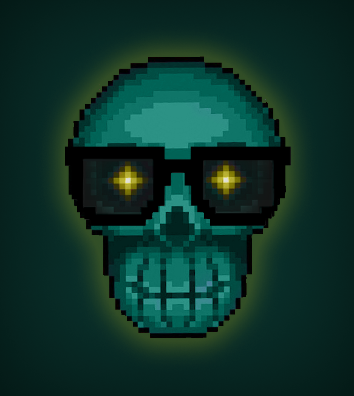

<h1 align="center">
  🕯 RanBot Carter 🕯
</h1>

<h1 align="center">🎩 Make your Discord avatar more handsome 💀</h1>

 

### This is a Discord Bot made for friends, with the purpose of bringing you back a humorous modified version of your current avatar.

## Technologies used in the project:
- JavaScript (Node)
    - Discord.js

## Coding Style Guide:
- Airbnb JavaScript style

## How to run:
- Add later...

## Contributions
<h3>Pull requests are welcome</h3>

So if you have an idea on how to improve this repository, I will appreciate
the opening of an issue to check the change you want to make.

<!-- ## Credits -->

## Project Status:

### `Version: 0.0.1`

## License
#### MIT © [Luciano Esteban](https://github.com/LucioFex)
