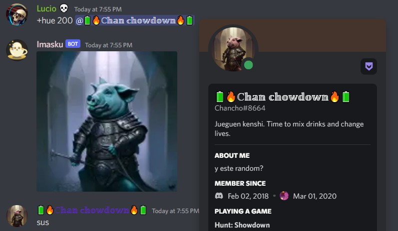

<h1 align="center">
 <p>Imasku</p>
 <p>🎩 A Pocket Photo Editor Bot 💀</p>
 <p align="center"></p>
</h1>


## A Bot for What?
#### Imasku is a minimalist Discord Bot that wants to save you time when opening a manual photo editor.
Paste an image on a Discord server, select one of *21 available effects*, then send the message.
The Bot will return the result.

`Command example:`
```
+rotate 45
```

## List of available effects


### Use examples



## Technologies used in the project:
- JavaScript (Node)
    - [Discord.js](https://discord.js.org/#/)@13.9.0
    - [Sharp](https://sharp.pixelplumbing.com/)0.30.7
    - [Got](https://github.com/sindresorhus/got#readme)@12.0.3

## Coding Style Guide:
- Airbnb JavaScript style

## How to run:
- As a Discord user:
    - You can invite the Bot to your server by accessing [Here](https://discord.com/api/oauth2/authorize?client_id=949779718478106665&permissions=413390982208&scope=bot).
- As a programmer:
    - Download the `package.json` dependencies.
    - Create a `.env` file, including the corresponding parameters (detailed in the `.env.example` file).
    - Run the commands `npm run start` or `npm run dev` in the terminal.

## Contributions
<h3>Pull requests are welcome</h3>

So if you have an idea on how to improve this repository, I will appreciate
the opening of an issue to check the change you want to make.

## Credits
- Wand icon: [Freepik (Flaticon)](https://www.flaticon.com/free-icon/enhance_7078037?term=effect&page=1&position=79&page=1&position=79&related_id=7078037&origin=search).
- Skull icon: [Freepik (Flaticon)](https://www.flaticon.com/free-icon/skull_983061).
- Info icon: [Freepik (Flaticon)](https://www.flaticon.com/free-icon/info_390979?related_id=391181&origin=search).
- Tea Cup icon: [Smashicons (Flaticon)](https://www.flaticon.com/free-icon/tea-cup_1601057).

## Project Status:

### `Version: 1.0.3`

## License
#### MIT © [Luciano Esteban](https://github.com/LucioFex)
